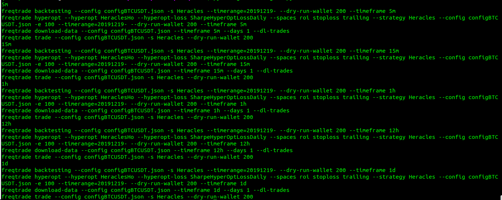
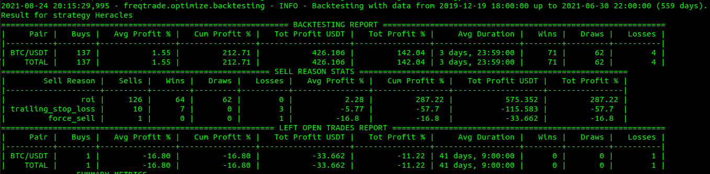
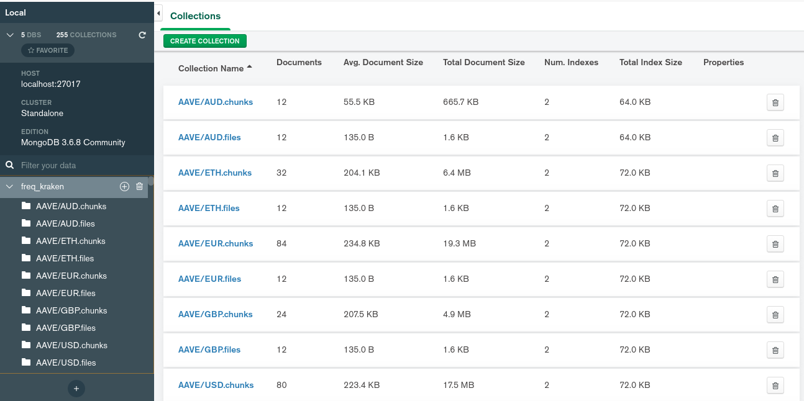

## Kthulu Fetch


kthulu-fetch processes the OHLCV sets obtained from the kraken exchange and formats it for freqtrade. It is capable of exporting the formatted data to mongodb via GridFS for long-term storage and further data manipulation.
### Tech
- freqtrade: https://github.com/freqtrade/freqtrade
- kraken-exchange: https://www.kraken.com/en-us/features/

### Issue
The Kraken API seems to be causing issues when retrieving OHLCV data and the downloading convention differs from that of other exchanges.  Downloading OHLCV directly from the API is currently not supported. You first download the trades and convert it directly to candle-stick. Further, Krakens API rate-limit makes for an exceptionally slow establishment of big data.
- see: https://www.freqtrade.io/en/stable/exchanges/#historic-kraken-data

## Solution
Kthulu-fetch leverages python3 to convert the archive obtained from krakens official website and stores it in the freqtrade read-in directory and mongoDB.

## Monitor

Its a good idea to monitor your machines performance for this operation:

```sh
sudo apt install htop
htop
```

## Installation
**Choose the coins you want to use freqtrade with**

Line 9 contains the get_coins conversion list: 

```sh
~/freqtrade/user_data/data/fetch_freq_OHLCV.py
```
example:
```python
get_coins = ['XBT', 'ETH', 'ADA', 'MLN', 'EWT', 'AAVE', 'ALGO', 'ATOM', 'BCH', 'EOS', 'ETC', 'KAVA', 'KSM', 'LINK', 'LTC', 'MANA', 'MLN', 'QTUM', 'STORJ', 'WAVES', 'XTZ', 'USDT']
```

**Linux + MacOS**:
```sh
git clone https://github.com/SeanKnig/freqtrade.git
cd freqtrade;
./setup.sh -k
```


**Windows**:

1.) Install via freqtrade docs: 
https://www.freqtrade.io/en/stable/windows_installation/

2.) Perform steps 2-4 below

**Manual setup**:

1.) Install freqtrade and configure on your machine:
https://www.freqtrade.io/en/stable/installation/

2.) Download Krakens public OHLCV data-set: 
https://support.kraken.com/hc/en-us/articles/360047124832-Downloadable-historical-OHLCVT-Open-High-Low-Close-Volume-Trades-data

3.) Make required folders and extract the OHLCV data to kraken_csv/all:

```sh
mkdir ~/freqtrade/user_data/data/kraken
mkdir ~/freqtrade/user_data/data/kraken_csv
mkdir ~/freqtrade/user_data/data/kraken_csv/all
mkdir ~/freqtrade/user_data/data/kraken_csv/avengers
```

```sh
~/freqtrade/user_data/data/kraken_csv/all
```

4.) Create a tmp folder or modify the code to use an existing one:

**Option1**:
```sh
mkdir ~/freqtrade/user_data/data/tmp
```

**Option2 => Use current tmp**:

**Line 22 of**: 

```sh
~/freqtrade/user_data/data/fetch_freq_OHLCV.py
```

**Modify**

```sh
'fetch_freq_json' : f'cd {thisdir}/kraken_csv/avengers; sed -i "s/e/E/g" {file}; cut -d"," -f -6 {file} > {thisdir}/tmp/output_{file}',
```

**to**:

```sh
'fetch_freq_json' : f'cd {thisdir}/kraken_csv/avengers; sed -i "s/e/E/g" {file}; cut -d"," -f -6 {file} > your_tmp_directory/output_{file}',
```

## Use
You might want to use sudo and/or augment the permissions of your freqtrade directory:

Directory permissions:

```sh
sudo chown $USER:$USER ./freqtrade
```

Configure Line 106 of: 

```sh
~/freqtrade/user_data/data/export_to_freq.py
```

for your DB instance 

Then :

```sh
python3 fetch_freq_OHLCV.py
```

There is a nifty function at the root of the forked freqtrade directory called genTrainingSet.py:

```sh
python3 genTrainingSet.py
```



Copy and paste a backtest:

```sh
freqtrade backtesting --config configBTCUSDT.json -s Heracles --timerange=20191219- --dry-run-wallet 300 --timeframe 1h
```



MongoDB will store the data as a binary file as it exceeds the maximum file size.



## License

MIT
